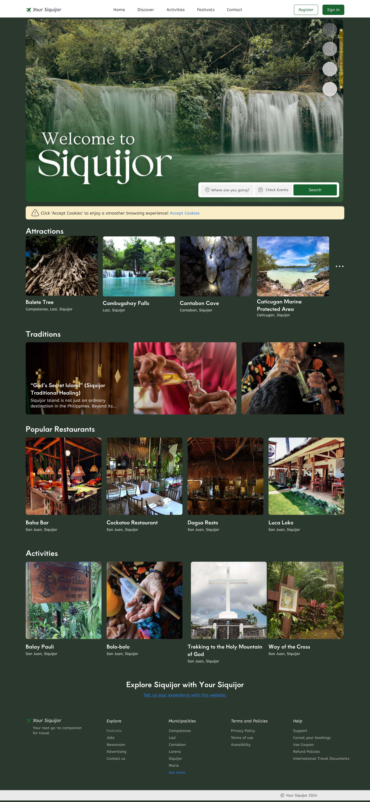

# 🌴 Siquijor Website Design  

This repository contains the Figma design for a **Siquijor tourism website**.  
The design highlights the beauty of Siquijor, featuring stunning visuals, an interactive gallery, and information about the island.  

## 📄 View the Design  
🔹 **Figma Design:** [Siquijor Figma File](https://www.figma.com/design/LO76yxrL5FVUUDjkKcdxOd/Siquijor-figma?node-id=0-1&t=rGBO2q7h2GkCpgdk-1)  
🔹 **PDF Version:** [Download from Google Drive](https://drive.google.com/file/d/1T48CiS7FI1QZd503jl0WoLIInMDd3ojR/view?usp=sharing)  

## 🎨 Features  
- 📌 Modern and clean UI  
- 🌅 Beautiful high-quality images of Siquijor  
- 🗺️ **Interactive Map of Siquijor** with **clickable pins** for tourist spots  
- 🏨 **Interactive Calendar** for a **hotel booking system**     
- 📱 Sections for Attractions, Festivals, & Restaurants all around Siquijor!  

## 📸 Preview  

## 🏝️ Siquijor Homepage  

  

## 📂 Files in this Repository  
- `README.md` → Project details and links  
- `images/` → Screenshots of the design

## 👥 Contributors  
- [**Lance Adrian Acal**](github.com/lncadrnn)
- Abby D.
- Bryan G.
